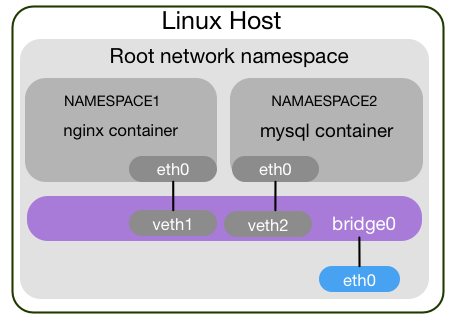

# Introduction to Docker and Kubernetes


## What is Namespaces?

Namespaces are a feature of the Linux kernel that partitions kernel resources such that one set of processes sees one set of resources while another set of processes sees a different set of resources.

As of kernel version 4.10, there are 7 kinds of namespaces:

Namespace   Constant          Isolates
Cgroup      CLONE_NEWCGROUP   Cgroup root directory
IPC         CLONE_NEWIPC      System V IPC, POSIX message queues
Network     CLONE_NEWNET      Network devices, stacks, ports, etc.
Mount       CLONE_NEWNS       Mount points
PID         CLONE_NEWPID      Process IDs
User        CLONE_NEWUSER     User and group IDs
UTS         CLONE_NEWUTS      Hostname and NIS domain name

### The namespaces API:
**clone()** and **unshare()**: system calls creates a new process or moves the calling process to a new
namespace. If the flags argument of the call specifies one or more of the CLONE_NEW* flags listed below, then new namespaces are created for each flag, and the child process is made a member of those namespaces.

**setns()**: system call allows the calling process to join an existing namespace.

```
# get namespaces of init process
ls -l /proc/1/n

# namespaces of PID
ls -l /proc/<PID>/ns/
```

### Mount (mnt):
* Mount namespaces provide isolation of the list of mount points seen by the processes in each namespace instance.
* the processes in each of the mount namespace instances will see distinct single-directory hierarchies.
* /proc/<PID>/mountinfo provide info about mnt namespace

### Process ID (PID):
* Provides processes with an independent set of process IDs (PIDs) from other namespaces.
* The first process created in a PID namespace is assigned the process id number 1 and receives most of the same special treatment as the normal init process.
* termination of this PID 1 process will immediately terminate all processes in its PID namespace and any descendants.
* initial PID namespace is able to see all processes, although with different PIDs than other namespaces will see processes with.

### Network (net):
* Network namespaces virtualize the network stack.
* On creation it contains only a loopback interface.
* Each network interface (physical or virtual) is present in exactly 1 namespace and can be moved between namespaces.
* Each namespace will have a private set of IP addresses, its own routing table, socket listing, connection tracking table, firewall, and other network-related resources.

### Interprocess Communication (ipc):

IPC namespaces isolate processes from SysV style inter-process communication. This prevents processes in different IPC namespaces from using, for example, the SHM family of functions to establish a range of shared memory between the two processes. Instead each process will be able to use the same identifiers for a shared memory region and produce two such distinct regions.


### UTS

### User ID (user)

### Control group (cgroup)

### Example:



docker run -id golang bash
docker export <ID> -o go_root.tar
mkdir go_root
tar xf go_root.tar --ignore-command-error -C go_root/
ip netns add test_net
=/var/run/netns/test_net
unshare --mount --uts --ipc --net --pid --fork --user --mount-proc --map-root-user chroot go_root bash
mount -t proc none /proc
mount -t sysfs none /sys
mount -t tmpfs none /tmp


ip link add veth0 type veth peer name eth0
ip link set eth0 netns test_net
ip addr add 172.16.99.1/24 dev veth0
ip link set veth0 up
ip netns exec test_net ip addr add 172.16.99.100/24 dev eth0
ip netns exec test_net ip link set lo up
ip netns exec test_net ip link set eth0 up
ip netns exec test_net ip route add default via 172.16.99.1


echo 1 > /proc/sys/net/ipv4/ip_forward
iptables -P FORWARD DROP
iptables -F FORWARD
iptables -t nat -F
iptables -t nat -A POSTROUTING -s 172.16.99.100/24 -o ens3 -j MASQUERADE
iptables -A FORWARD -i ens3 -o veth0 -j ACCEPT
iptables -A FORWARD -o ens3 -i veth0 -j ACCEPT

to clean

umount /run/netns/test_net
ip netns del test_net
