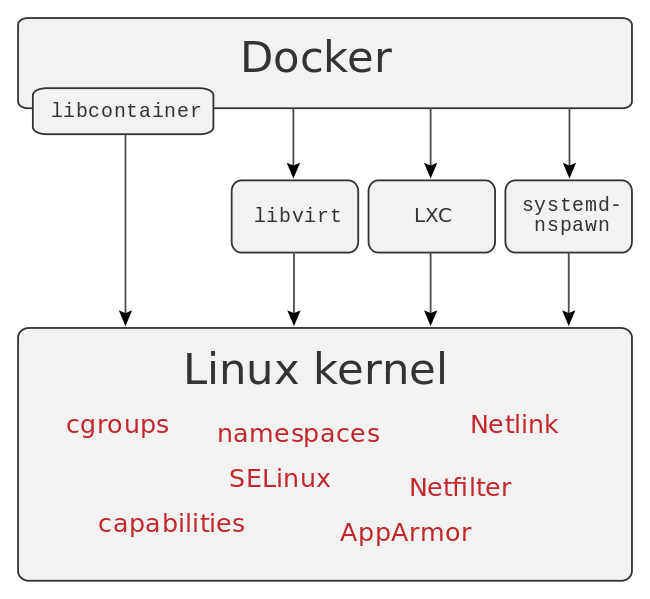

# Introduction to Docker Internals

## What is cgroups?

cgroups is a Linux kernel feature that limits, accounts for, and isolates the resource usage (CPU, memory, disk I/O, network, etc.) of a collection of processes.

* they are hierarchical (set of subsystems mounted together.)
* child cgroups inherit certain attributes from their parent cgroup.
* the actual resource tracking and limits are implemented by subsystems.

### Subsystems:
* blkio — this subsystem sets limits on input/output access to and from block devices such as physical drives (disk, solid state, or USB).

* cpu — this subsystem uses the scheduler to provide cgroup tasks access to the CPU.

* cpuacct — this subsystem generates automatic reports on CPU resources used by tasks in a cgroup.

* cpuset — this subsystem assigns individual CPUs (on a multicore system) and memory nodes to tasks in a cgroup.

* devices — this subsystem allows or denies access to devices by tasks in a cgroup.

* devices — this subsystem allows or denies access to devices by tasks in a cgroup.

* memory — this subsystem sets limits on memory use by tasks in a cgroup and generates automatic reports on memory resources used by those tasks.

* net_cls — this subsystem tags network packets with a class identifier (classid) that allows the Linux traffic controller (tc) to identify packets originating from a particular cgroup task.

* net_prio — this subsystem provides a way to dynamically set the priority of network traffic per network interface.

* ns — the namespace subsystem.

* perf_event — enables per-cpu mode to monitor only threads in certain cgroups.

## What is Union file systems?

Union file systems, or UnionFS, are file systems that operate by creating layers, making them very lightweight and fast. Docker Engine uses UnionFS to provide the building blocks for containers. Docker Engine can use multiple UnionFS variants, including AUFS, btrfs, vfs, and DeviceMapper.

## What is Namespaces?

Namespaces are a feature of the Linux kernel that partitions kernel resources such that one set of processes sees one set of resources while another set of processes sees a different set of resources.

As of kernel version 4.10, there are 7 kinds of namespaces.

### The namespaces API:
**clone()** and **unshare()**: system calls creates a new process or moves the calling process to a new
namespace. If the flags argument of the call specifies one or more of the CLONE_NEW* flags listed below, then new namespaces are created for each flag, and the child process is made a member of those namespaces.

**setns()**: system call allows the calling process to join an existing namespace.

```
# get namespaces of init process
ls -l /proc/1/n

# namespaces of PID
ls -l /proc/<PID>/ns/
```

### Mount (mnt):
* Mount namespaces provide isolation of the list of mount points seen by the processes in each namespace instance.
* the processes in each of the mount namespace instances will see distinct single-directory hierarchies.
* /proc/PID/mountinfo provide info about mnt namespace
* Used in Docker by default

### Process ID (PID):
* Provides processes with an independent set of process IDs (PIDs) from other namespaces.
* The first process created in a PID namespace is assigned the process id number 1 and receives most of the same special treatment as the normal init process.
* termination of this PID 1 process will immediately terminate all processes in its PID namespace and any descendants.
* initial PID namespace is able to see all processes, although with different PIDs than other namespaces will see processes with.
* Used in Docker by default

### Network (net):
* Network namespaces virtualize the network stack.
* On creation it contains only a loopback interface.
* Each network interface (physical or virtual) is present in exactly 1 namespace and can be moved between namespaces.
* Each namespace will have a private set of IP addresses, its own routing table, socket listing, connection tracking table, firewall, and other network-related resources.
* Used in Docker by default

### Interprocess Communication (ipc):

* IPC namespaces isolate processes from inter-process communication. (Pipes, FIFOs, Pseudoterminals, Sockets, POSIX message queues, POSIX shared memory, Signals)
* The Linux IPC namespace partitions shared memory primitives like named shared memory blocks and semaphores, as well as message queues.
* The IPC namespace prevents processes in one container from accessing the memory on the host or in other containers.
* sharing IPC namespace is often used when the latency associated with network or pipe based IPC drags software performance below requirements. The best examples of shared memory based IPC usage is in scientific computing and some popular database technologies like PostgreSQL.
* Docker creates a unique IPC namespace for each container by default.

Here is a nice example about shred IPC https://github.com/allingeek/ch6_ipc


### UTS
* UTS namespaces allow a single system to appear to have different host and domain names to different processes.
* By default, all containers have their own UTS namespace.

### Control group (cgroup)
* The cgroup namespace hides the identity of the control group of which process is a member.
* Not used in Docker (but definitely the cgroups itself is used)

### User ID (user)
* user namespace support enables a process (that belong to specific user namespace) to have a unique range of user and group IDs which are outside the traditional user and group range utilized by the host system.
* User namespaces are an advanced feature and require coordination with other capabilities.
* Provides a better isolation and security but has some limitation
* Not used in Docker by default

## What is Docker Engine?



* Docker Engine combines the namespaces, control groups, and UnionFS into a wrapper called a container format.

* The default container format is libcontainer. In the future, Docker may support other container formats by integrating with technologies such as BSD Jails or Solaris Zones.

### Security:
Docker Engine makes use of:

* AppArmor a Linux kernel security module allows to restrict programs capabilities with per-program profiles.

* Seccomp used for filtering syscalls issued by a program. seccomp allows a process to make a one-way transition into a "secure" state where it cannot make any system calls except exit(), sigreturn(), read() and write() to already-open file descriptors.

* Capabilties provide fine-grained control over superuser permissions, allowing use of the root user to be avoided. For example:
```bash
getcap /usr/bin/ping
```

* User namespace could also be enabled.


## Example: Containers without docker!


The following example explains the previous concepts. You will be able to implement a container (similiar to docker container) without using any docker platform. 

First we need a root filesystem. The easiest way is to run a docker container and extract its content to local directory:
```bash
docker run -id golang bash
docker export <ID> -o go_root.tar
mkdir go_root
tar xf go_root.tar --ignore-command-error -C go_root/
```

Then create a network namespace:
```bash
ip netns add net_demo
```

Use `unshare` (wrapper in util-linux to call `unshare` syscall) to run bash in chroot environment and new namespaces:
```bash
# with new user namespace and mapping root user with less privileged access
unshare --mount --uts --ipc --net=/var/run/netns/net_demo --pid --fork --user --map-root-user chroot go_root /bin/bash

# without user namespace
unshare --mount --uts --ipc --net=/var/run/netns/net_demo --pid --fork --setgroups=allow chroot go_root /bin/bash
# inside the container
mount -t proc none /proc
mount -t sysfs none /sys
mount -t tmpfs none /tmp
```
Now you can check the PIDs, it similar to the one you find inside any docker container.

Then cgroups will be used to limit the memory usage. Create a new cgroup:
```bash
mkdir /sys/fs/cgroup/memory/demo
# limit memory usage by 100mb and disable swappiness
echo "100000000" > /sys/fs/cgroup/memory/demo/memory.limit_in_bytes
echo "0" > /sys/fs/cgroup/memory/demo/memory.swappiness
```

Get the init process of the container:
```
ps aux | grep /bin/bash | grep root
```

Add it to demo cgroup:
```
echo <PID> > /sys/fs/cgroup/memory/demo/tasks
```

Adding capabilities to allow creation of `/dev/urandom` (special file for pseudorandom number generators):
```bash
setcap CAP_MKNOD=+eip go_root/bin/mknod
mknod -m 644 /dev/urandom c 1 9
```

Test the memory limit using this python code:
```python
f = open("/dev/urandom", "r")
data = ""

i=0
while True:
    data += f.read(10000000) # read 10mb
    i += 1
    print "%dmb" % (i*10)
```

Configure network namespace and add interfaces:
```bash
ip link add veth1 type veth peer name eth0
ip link set eth0 netns net_demo
ip addr add 172.16.99.1/24 dev veth1
ip link set veth1 up
ip netns exec net_demo ip addr add 172.16.99.100/24 dev eth0
ip netns exec net_demo ip link set lo up
ip netns exec net_demo ip link set eth0 up
ip netns exec net_demo ip route add default via 172.16.99.1
```

Enable IP forwarding and forward virtual inrerface traffic:
```bash
echo 1 > /proc/sys/net/ipv4/ip_forward
iptables -P FORWARD DROP
iptables -F FORWARD
iptables -t nat -F
iptables -t nat -A POSTROUTING -s 172.16.99.100/24 -o ens3 -j MASQUERADE
iptables -A FORWARD -i ens3 -o veth1 -j ACCEPT
iptables -A FORWARD -o ens3 -i veth1 -j ACCEPT
```
Finally test using `ping`

To clean the network namespace:
```bash
umount /run/netns/net_demo
ip netns del net_demo
```

To test mnt:
```
mount --bind -o ro volume go_root/var/readonlyfiles/
``
